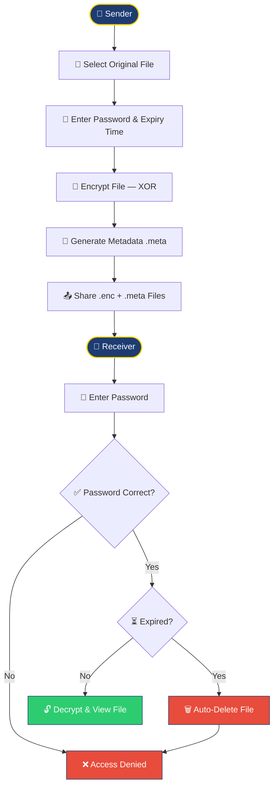
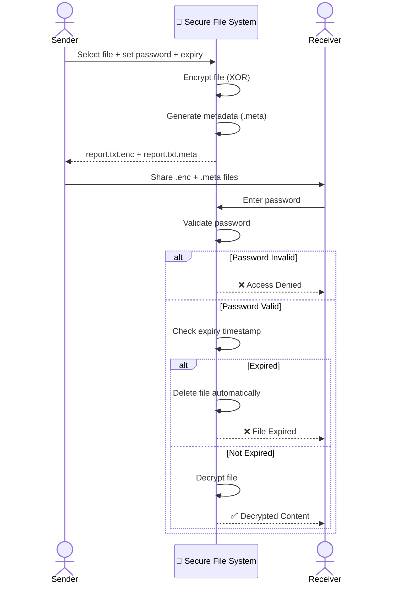
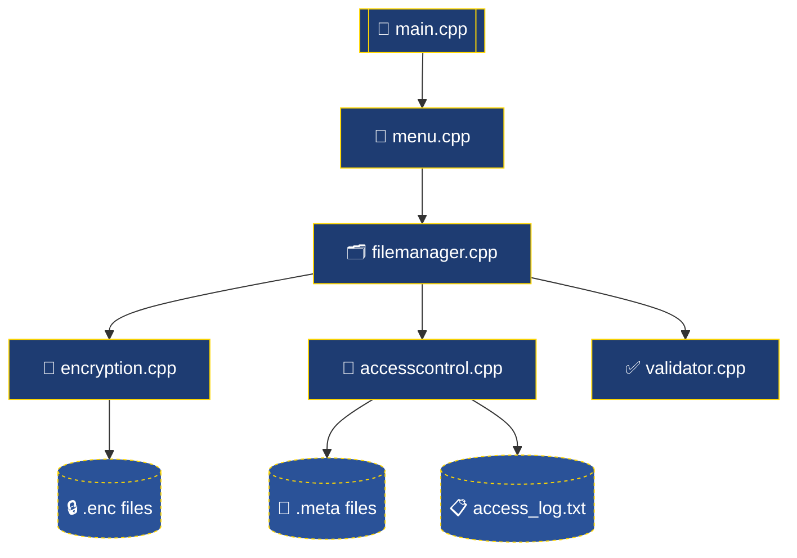

<a name="top"></a>
<div align="center">


<br/>


<br/><br/>


</div>

<br/>

> A desktop-based Information Security project that demonstrates secure file sharing using **encryption**, **password-based authentication**, and **time-limited access control** — ensuring only authorized users can open a shared file, and only before it expires.

<br/>

### ⚡ Quick Start

```bash
git clone https://github.com/Talha-Yaseen-Hub/Secure-File-Distribution-System.git
cd Secure-File-Distribution-System
g++ *.cpp -o securefile
./securefile
```

<br/>

## 📑 Table of Contents

<table>
<tr>
<td valign="top">

- [📖 About the Project](#about-the-project)
- [🎯 Project Objectives](#project-objectives)
- [✨ Key Features](#key-features)
- [🧠 System Workflow](#system-workflow)
- [🔄 Sequence Diagram](#sequence-diagram)
- [🧩 Module Architecture](#module-architecture)
- [🛠️ Tech Stack](#tech-stack)
- [📂 Project Structure](#project-structure)
- [📄 Source Code Overview](#source-code-overview)

</td>
<td valign="top">

- [🔄 Project Execution](#project-execution)
- [🔐 Security Concepts Demonstrated](#security-concepts-demonstrated)
- [📷 Sample Output](#sample-output)
- [🚀 Getting Started](#getting-started)
- [📚 Learning Outcomes](#learning-outcomes)
- [⚠️ Limitations](#limitations)
- [🚀 Future Enhancements](#future-enhancements)
- [🎓 Academic Information](#academic-information)
- [👨‍💻 Author](#author)

</td>
</tr>
</table>

---

## 📖 About the Project

File sharing has become an essential part of modern communication, but traditional methods often fail to provide proper security **after** a file has been distributed. Once shared, the sender usually loses all control over who accesses the file and for how long.

This project solves that problem with a **Secure File Distribution System** — it protects files through encryption and restricts access using password verification combined with an automatically enforced expiry timer.

Developed as part of the **Information Security** course, this project demonstrates fundamental security concepts — confidentiality, authentication, and access control — in a practical, hands-on environment.

<br/>

## 🎯 Project Objectives

<div align="center">

| | Objective |
|:---:|---|
| 🔐 | Protect files using encryption |
| 🔑 | Restrict access through password authentication |
| ⏳ | Implement time-limited file access |
| 📁 | Enable secure confidential file sharing |
| 📝 | Maintain a complete access log |
| 💻 | Demonstrate core Information Security principles in practice |

</div>

<br/>

## ✨ Key Features

| | Feature | Description |
|:---:|---|---|
| 🔒 | **File Encryption** | Encrypts files with XOR-based encryption before they're shared |
| 🔓 | **File Decryption** | Restores original content only after successful authentication |
| 🔑 | **Password Protection** | Access is locked behind a sender-defined password |
| ⏰ | **Expiry Validation** | Every access attempt is checked against a hard expiry timestamp |
| 📂 | **Metadata Generation** | Password + expiry data stored in a dedicated `.meta` file |
| 📋 | **Access Logging** | Every attempt — successful or failed — is written to `access_log.txt` |
| ⚠️ | **Input Validation** | Blocks invalid file names, empty passwords, and malformed expiry values |
| ❌ | **Invalid Access Detection** | Flags and rejects incorrect password attempts |
| 🗑️ | **Auto-Deletion** | Expired files are automatically removed, closing the access window for good |
| 🧩 | **Modular Architecture** | Each responsibility lives in its own isolated module |
| 💻 | **Console Interface** | Lightweight, dependency-free, runs anywhere g++ does |

<br/>

## 🧠 System Workflow



<br/>

## 🔄 Sequence Diagram



<br/>

## 🧩 Module Architecture



> `filemanager.cpp` is the central controller — it's the only module that talks directly to encryption, access control, and validation, keeping every other module decoupled from the rest.

<br/>

## 🛠️ Tech Stack

<div align="center">


</div>

| Technology | Purpose |
|---|---|
| **C++** | Application development |
| **File Handling** | Reading/writing encrypted and metadata files |
| **XOR Encryption** | Data protection (educational purpose) |
| **Time Library** | Expiry timestamp validation |
| **Modular Programming** | Code organization and separation of concerns |
| **Visual Studio Code** | Development environment |
| **MinGW g++** | Compilation |

<br/>

## 📂 Project Structure

```text
SecureFileDistributionSystem/
│
├── 📁 Source
│   ├── main.cpp
│   ├── menu.cpp
│   ├── filemanager.cpp
│   ├── encryption.cpp
│   ├── accesscontrol.cpp
│   └── validator.cpp
│
├── 📁 Header Files
│   ├── menu.h
│   ├── filemanager.h
│   ├── encryption.h
│   ├── accesscontrol.h
│   └── validator.h
│
├── 📁 Sample Files
│   ├── report.txt
│   ├── report.txt.enc
│   ├── report.txt.meta
│   └── access_log.txt
│
├── 📁 Documentation
│   ├── Project Proposal.pdf
│   ├── Project Documentation.pdf
│   └── Presentation.pptx
│
└── README.md
```

<br/>

## 📄 Source Code Overview

| File | Type | Responsibility |
|---|---|---|
| `main.cpp` | Source | Entry point. Controls program flow, initializes the system, calls menu functions |
| `menu.cpp` | Source | Displays the console menu and handles user selections |
| `menu.h` | Header | Function declarations for the menu module |
| `filemanager.cpp` | Source | Central controller — coordinates encryption, metadata creation, password verification, decryption, and logging |
| `filemanager.h` | Header | Declares the file management functions used throughout the app |
| `encryption.cpp` | Source | Performs XOR encryption/decryption and handles binary file operations |
| `encryption.h` | Header | Prototypes for encryption/decryption operations |
| `accesscontrol.cpp` | Source | Manages password authentication, expiry validation, metadata, and auto-deletion |
| `accesscontrol.h` | Header | Declares access-control-related functions |
| `validator.cpp` | Source | Validates user input, file existence, and expiry values |
| `validator.h` | Header | Declarations for validation functions |
| `report.txt` | Sample | Demonstration file used to test encryption/decryption |
| `report.txt.enc` | Generated | Encrypted version of the original file, shared with the receiver |
| `report.txt.meta` | Generated | Stores metadata — password and expiry timestamp |
| `access_log.txt` | Generated | Records successful and failed access attempts |

<br/>

## 🔄 Project Execution

<table>
<tr><td width="33%" valign="top">

### 1️⃣ Secure File
- Enter file name
- Enter password
- Enter expiry time
- File is encrypted
- Metadata is generated

```text
report.txt.enc
report.txt.meta
```

</td><td width="33%" valign="top">

### 2️⃣ Share Files
Send both generated files to the receiver:

```text
report.txt.enc
report.txt.meta
```

</td><td width="33%" valign="top">

### 3️⃣ Open Secure File
Receiver runs the app and enters:
- File name
- Password

✔ Correct password
✔ Not expired
➡️ **Decrypted successfully**

❌ Otherwise → **Access denied**

</td></tr>
</table>

<br/>

## 🔐 Security Concepts Demonstrated

<div align="center">


</div>

<br/>

## 📷 Sample Output

<table>
<tr><td valign="top">

**Main Menu**
```text
=============================
 Secure File System
=============================
1 Secure File
2 Open Secure File
3 Exit
```

</td><td valign="top">

**Secure File**
```text
Enter file name:
report.txt

Set password:
1234

Enter expiry time:
5

File secured successfully.
```

</td><td valign="top">

**Open Secure File**
```text
Enter file name:
report.txt

Enter password:
1234

File Content:
Information Security Notes...
```

</td></tr>
</table>

> 💡 Tip: Replace these console captures with real terminal screenshots or a short GIF demo — it's one of the highest-impact upgrades you can make to this README.

<br/>

## 🚀 Getting Started

**Prerequisites:** a C++ compiler (g++ / MinGW) and a terminal.

<details>
<summary><b>🪟 Windows (PowerShell)</b></summary>

```powershell
g++ *.cpp -o securefile
.\securefile.exe
```
</details>

<details>
<summary><b>🐧 Linux / 🍎 macOS</b></summary>

```bash
g++ *.cpp -o securefile
./securefile
```
</details>

<br/>

## 📚 Learning Outcomes

This project demonstrates practical implementation of:

- File Encryption
- Authentication
- Access Control
- Time Validation
- Modular Programming
- Secure File Management

<br/>

## ⚠️ Limitations

| Limitation | Note |
|---|---|
| XOR encryption | Used for educational purposes — not cryptographically strong like AES |
| Local desktop only | No network-based file transfer |
| Console interface | No GUI |
| Prototype scope | Built for learning, not production deployment |

<br/>

## 🚀 Future Enhancements

- [ ] AES-256 Encryption
- [ ] PBKDF2 password-based key derivation
- [ ] SHA-256 password hashing
- [ ] Graphical User Interface (GUI)
- [ ] Secure network-based file sharing
- [ ] Database integration
- [ ] Digital signatures
- [ ] Multi-user authentication
- [ ] Cloud storage support

<br/>

## 🧩 Design Principles

<div align="center">


</div>

Each module performs a single responsibility, making the code easier to understand, debug, and extend in future versions.

<br/>

## 📖 Documentation

This repository also includes:

- 📄 Project Proposal
- 📘 Complete Project Documentation
- 📊 Presentation Slides

<br/>

## 🎓 Academic Information

| | |
|---|---|
| **Course** | Information Security |
| **Project Type** | Info Sec — 4th Semester Project |
| **Language** | C++ |
| **Development Environment** | Visual Studio Code |
| **Year** | 2026 |

<br/>

## 👨‍💻 Author

<div align="center">

### Talha Yaseen
**Roll No: BITF24M041**

🎓 BS Information Technology &nbsp;•&nbsp; 🏫 FCIT &nbsp;•&nbsp; 📚 Information Security Project (2026)

<a href="mailto:talhavectorarts@gmail.com">
  
</a>
<a href="https://www.linkedin.com/in/talha-yaseen-44a41a341">
  
</a>
<a href="https://github.com/Talha-Yaseen-Hub">
  
</a>

</div>

<br/>

## ⭐ Support This Project

<div align="center">

If this project helped you understand file security concepts, consider giving it a **star** — it genuinely helps and motivates further educational builds like this one.


</div>

<br/>

## 📜 MIT License

<div align="center">


This project is licensed under the **MIT License** — see the [LICENSE](./LICENSE) file for full details.

</div>

<br/>

<div align="center">

[⬆ Back to Top](#top)

### 🔐 Happy Learning!

*"Security is a continuous process, not a one-time solution."*

</div>

<br/>

<div align="center">

[⬆ Back to Top](#top)


</div>
